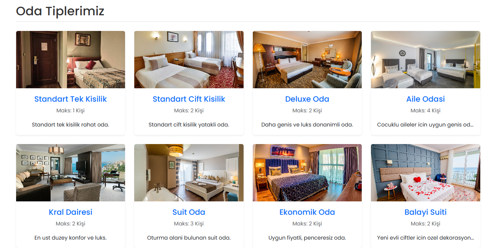
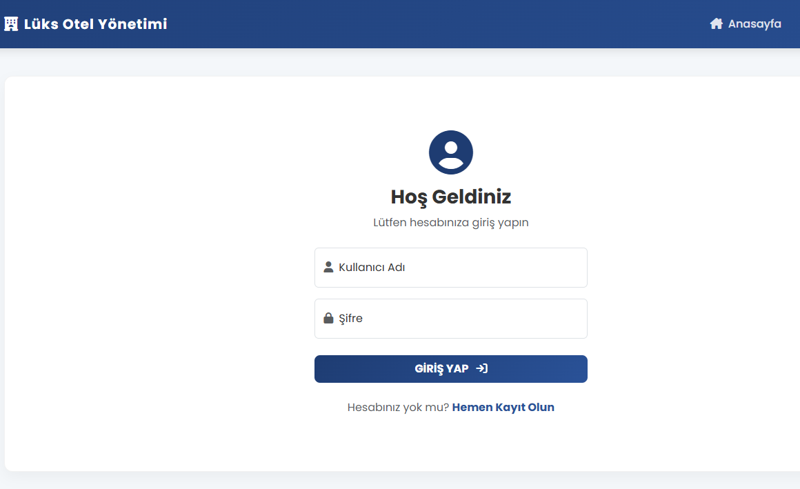
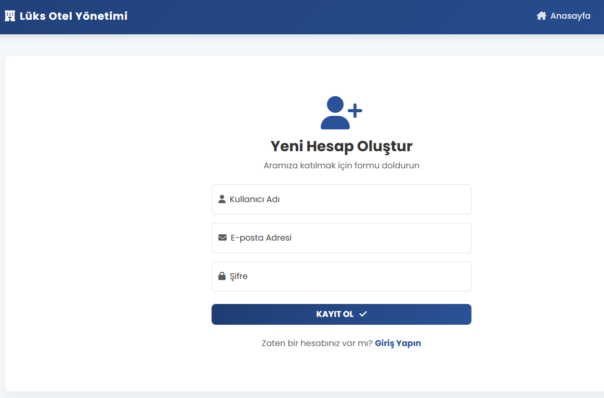
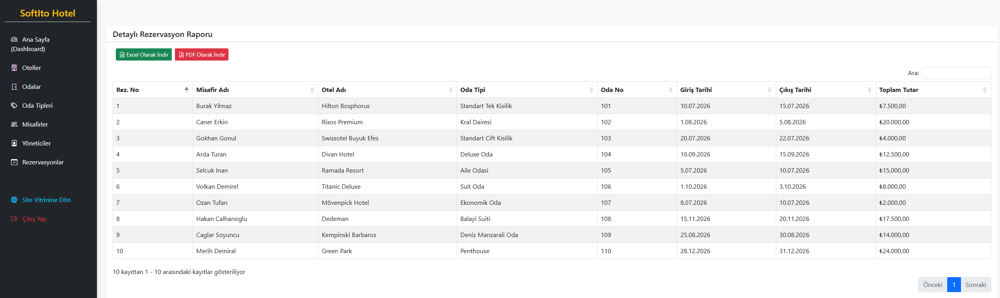
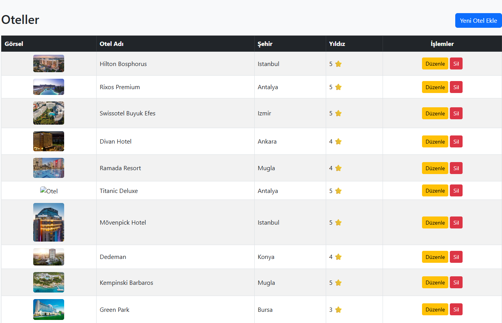
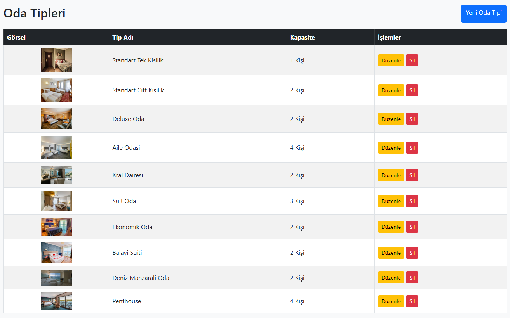
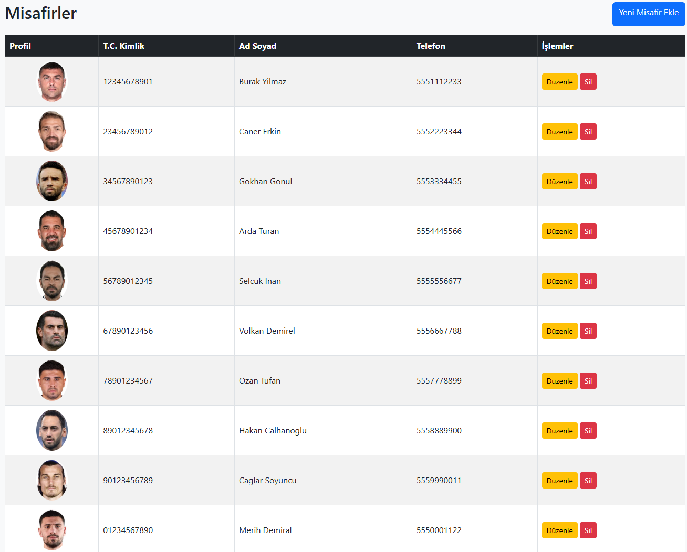
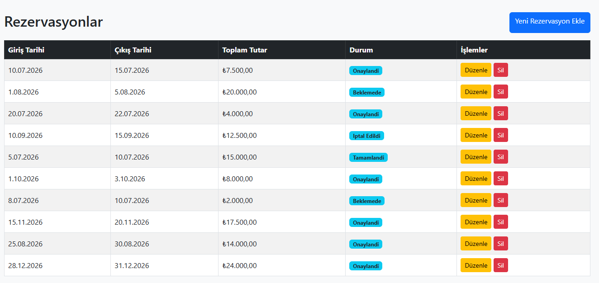

# 🏨 SoftIto - Proje 10: N-Tier Architecture ile Otel Rezervasyon Sistemi

Bu proje, **İstanbul Ticaret Odası (İTO)** tarafından yürütülen **SoftIto Projesi** kapsamındaki **Backend Eğitimi**'nin 10. projesi olarak geliştirilmiştir. 

Proje, modern yazılım prensiplerinden olan **N-Tier (Çok Katmanlı) Mimari** kullanılarak inşa edilmiş kapsamlı bir Otel Rezervasyon ve Yönetim Sistemidir.

## 🚀 Proje Hakkında (Özellikler)

Bu projede bir otel veya otel zincirinin ihtiyaç duyabileceği temel yönetim ve müşteri listeleme ekranları tasarlanmıştır.

- **Çok Katmanlı Mimari:** Entity, Data, Business ve Presentation (MVC) katmanları ayrılarak temiz kod (Clean Code) prensipleri uygulanmıştır.
- **Yönetim Paneli (Admin Area):** Oteller, Odalar, Oda Tipleri, Yöneticiler, Misafirler ve Rezervasyonların CRUD (Ekleme, Silme, Güncelleme, Okuma) işlemleri.
- **Müşteri Ekranı (User Area):** Müşterilerin mevcut otelleri, oda tiplerini ve detaylarını görebildiği modern arayüz.
- **Rol Bazlı Yetkilendirme:** ASP.NET Core Identity ile güvenli giriş, kayıt ve çıkış işlemleri. Yönetici ve kullanıcı rollerinin ayrımı.
- **Detaylı Raporlama:** Dashboard üzerinden Entity Framework "Include" (Join) işlemleri ile birden fazla tablonun birleştirilerek anlamlı raporlara dönüştürülmesi.
- **Veri Dışa Aktarımı:** DataTables JS kütüphanesi kullanılarak tabloların tek tıkla **PDF** ve **Excel** formatlarında indirilmesi.

## 🛠️ Kullanılan Teknolojiler

- **Backend:** C#, ASP.NET Core MVC (.NET)
- **Veritabanı & ORM:** MS SQL Server, Entity Framework Core
- **Kimlik Doğrulama:** ASP.NET Core Identity
- **Mimari:** N-Tier Architecture (Çok Katmanlı Mimari), Repository Pattern (Tasarım Deseni)
- **Frontend:** HTML5, CSS3, Bootstrap 5, FontAwesome
- **Kütüphaneler:** DataTables, jsPDF, jQuery (Raporlama ve Export işlemleri için)

## 📁 Proje Katmanları

Proje 4 ana katmandan oluşmaktadır:
1. **HotelReservationSystem.Entity:** Veritabanı tablolarına karşılık gelen modellerin bulunduğu katman.
2. **HotelReservationSystem.Data:** Veritabanı bağlantısı (DbContext), Migration'lar ve veri erişim (Repository) işlemlerinin bulunduğu katman.
3. **HotelReservationSystem.Business:** İş kurallarının yazıldığı ve Data katmanı ile MVC katmanı arasında köprü görevi gören servis katmanı.
4. **HotelReservationSystem.MVC:** Kullanıcının etkileşime girdiği Controller ve View dosyalarını barındıran sunum katmanı.

## ⚙️ Kurulum ve Çalıştırma

1. Projeyi bilgisayarınıza klonlayın.
2. `HotelReservationSystem.Data` katmanı içerisindeki `HotelDbContext` veya `appsettings.json` içerisindeki **Connection String** ayarlarını kendi SQL Server'ınıza göre güncelleyin.
3. Package Manager Console (PMC) üzerinden veri tabanını oluşturmak için `Update-Database` komutunu çalıştırın.
4. (Opsiyonel) Proje için hazırlanan SQL Insert scriptlerini çalıştırarak test verilerini (Otel, Oda, Misafir, Resim vb.) veritabanınıza ekleyebilirsiniz.
5. Projeyi çalıştırın (F5) ve sistemi test edin.

## 📝 Kullanım

- **Admin Girişi:** `/Admin/Dashboard` rotası üzerinden yönetim paneline erişebilir, otelleri ve odaları yönetebilirsiniz.
- **Rapor İndirme:** Dashboard'da bulunan rezervasyon raporu tablosunun üzerindeki Excel ve PDF butonlarını kullanarak rapor dökümü alabilirsiniz.

---

*Bu proje SoftIto Backend Eğitimi pratikleri kapsamında geliştirilmiştir.*

## 📸 Ekran Görüntüleri (Screenshots)

Sistemin arayüzüne ve yönetim paneline ait ekran görüntülerine aşağıdan ulaşabilirsiniz:

### 🌐 Kullanıcı Ekranları (User Area)

#### Anasayfa (Üst Kısım)

#### Anasayfa (Alt Kısım & Detaylar)

---

### 🔐 Kimlik Doğrulama Sayfaları (Authentication)

<table width="100%">
  <tr>
    <td width="50%" align="center">
      <strong>Giriş Yap (Login)</strong> 
      
    </td>
    <td width="50%" align="center">
      <strong>Kayıt Ol (Register)</strong> 
      
    </td>
  </tr>
</table>

---

### 📊 Yönetim Paneli (Admin Area)

#### Admin Dashboard (Genel Raporlama Ekranı)

#### Otel Yönetimi (CRUD)

#### Oda Tipleri Yönetimi

#### Misafir Yönetimi

#### Rezervasyon Yönetimi & Raporlama

